### Processing Steps

This section will explain the processin steps for matching the string
* ___d2-1___ 

and the regular expression is 

* _cat|dog|[a-z][0-9]-[0-9]_ 

The basic processing steps are as follows:

Start at the begining of the graph with one process point __pos1__

at __pos1__ we find a control node that leads to three possible paths. We add all the paths to a process list:

| list | Target |
| --- | --- |
| pos1 | 'c' |
| pos2 | '[a-z]' |
| pos3 | 'd' |

we follow all these paths

[Next step1](process2.md)
