### Previous State

at __pos1__ we find a control node that leads to three possible paths. We add all the paths to a process list:

| list | Target |
| --- | --- |
| pos1 | '[a-z]' |
| pos2 | 'd'  |
| pos3 | 'c' |

> Test for character ___'d'___

### Step1

Each of the paths __pos1__, __pos2__, and __pos3__ require that we match a character, since we are trying to match ___"d2-"__

- [x] __pos1__ will try to match __'d'__ against _[a-z]_, that will match so we keep this path <image src="https://upload.wikimedia.org/wikipedia/commons//e/ef/Thumbs_up_font_awesome.svg" height="20px">
- [x] __pos2__ will try to match __'d'__ against _d_, that will match so we keep this path <image src="https://upload.wikimedia.org/wikipedia/commons//e/ef/Thumbs_up_font_awesome.svg" height="20px">
- [ ] pos3 will try to match __'d'__ against _c_, that will fail to match so we drop this path <image src="https://upload.wikimedia.org/wikipedia/commons/5/5d/Thumbs_down_font_awesome.svg" height="20px">

* We are left with 2 possible paths through the graph, ___pos1___ and ___pos2___
* _pos3_ is discarded because the character ___d___ does not match _'c'_ required for the path

[Next Step 2](step2.md)
