### Processing Steps

The basic processing steps are as follows:

Start at the begining of the graph with one process point __pos1__

at __pos1__ we find a control node that leads to three possible paths. We add all the paths to a process list:

| list |
| --- |
| pos1 |
| pos2 |
| pos3 |

we follow all these paths

[Next step1](process2.md)
