### Step1

https://upload.wikimedia.org/wikipedia/commons/e/ef/Thumbs_up_font_awesome.svg
Each of the paths __pos1__, __pos2__, and __pos3__ require that we match a character, since we are trying to match ___"d2-"__

- [x] __pos1__ will try to match __'d'__ against _[a-z]_, that will match so we keep this path <image src="https://upload.wikimedia.org/wikipedia/commons//e/ef/Thumbs_up_font_awesome.svg" height="20px">
- [ ] pos2 will try to match __'d'__ against _c_, that will fail to match so we drop this path <image src="https://upload.wikimedia.org/wikipedia/commons/5/5d/Thumbs_down_font_awesome.svg" height="20px">
- [x] __pos3__ will try to match __'d'__ against _d_, that will match so we keep this path <image src="https://upload.wikimedia.org/wikipedia/commons//e/ef/Thumbs_up_font_awesome.svg" height="20px">

